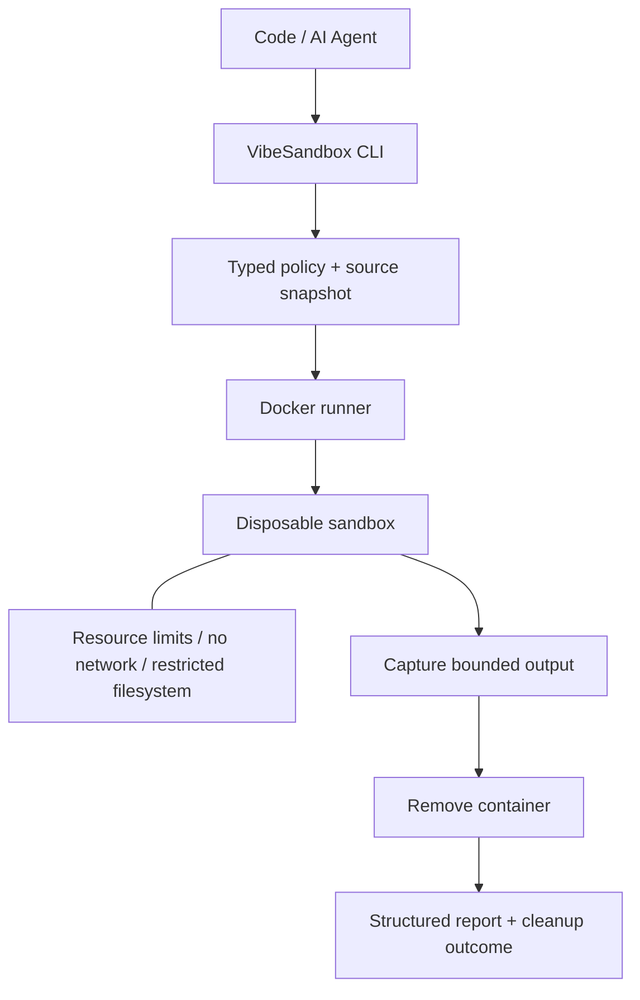

# Sollutions - VibeSandbox

Reliable local execution of AI-generated and untrusted code in disposable, policy-enforced sandboxes.

VibeSandbox is a security-focused local execution platform designed specifically for AI-generated and untrusted code. Isolation, resource controls, cleanup, policy enforcement and security regression testing are first-class product features.

> Built for the AI coding era: secure defaults, deterministic lifecycle handling, explicit security boundaries, and reproducible policy enforcement.

Python and JavaScript run in separate restricted Docker images. Automated tests exercise both successful execution and policy enforcement, including container removal. Docker shares a kernel: this is **not a hardened hostile multi-tenant execution service** or a guarantee against container escapes.



## Why

Generated code can consume resources, make unexpected network calls, or modify files before a developer notices. VibeSandbox provides a repeatable local execution boundary with deliberately non-configurable isolation controls. It adds validated resource policy, bounded reporting, safe source staging, cleanup checks and security regressions around Docker's primitives.

## Security defaults

| Control | Default |
| --- | --- |
| Identity | UID/GID 65532; never privileged |
| Network | Docker `none`; no published ports |
| Filesystem | Read-only root and source snapshot |
| Writable scratch | 16 MiB `/tmp`, `noexec,nosuid,nodev`; 1 MiB `/dev/shm` |
| Privileges | All capabilities dropped; no-new-privileges |
| Syscalls | Docker's built-in seccomp profile required |
| Resources | 128 MiB RAM, no extra swap, 0.5 CPU, 32 PIDs |
| Time | 5-second execution deadline; forced termination |
| Output | 64 KiB per stream; Docker log persistence disabled |
| Lifecycle | Random ID, fresh container, removal retried and reported |

Only the submitted file is staged; sibling files, dependencies, credentials and the Docker socket are never mounted. Symlinks in any source path component and `..` traversal are rejected. Interpreters receive argument arrays, not shell commands.

## Quick start

Requires Python 3.12+, [uv](https://docs.astral.sh/uv/getting-started/installation/), Make, and a running local Linux Docker engine (Docker Desktop or Colima on macOS). Linux cgroup memory/swap/CPU/PID controls and seccomp must be available. Windows execution is not supported; use a Linux environment with its own Docker engine.

```bash
git clone https://github.com/SollutionsIT/vibesandbox.git
cd vibesandbox
make setup
make demo
source .venv/bin/activate
vibesandbox run examples/hello.py
```

The Docker Python SDK uses `DOCKER_HOST`, not the CLI's active context. With Colima or a non-default local socket, set it before running:

```bash
export DOCKER_HOST="$(docker context inspect --format '{{.Endpoints.docker.Host}}')"
```

Remote TCP/SSH daemons are rejected. On macOS, temporary staging must be in a directory shared with the Linux VM. For Colima, run `mkdir -p .sandbox-tmp && chmod 700 .sandbox-tmp` and `export TMPDIR="$PWD/.sandbox-tmp"` before the demo if your default macOS temporary directory is not shared. The trusted daemon must be able to read that staging directory.

`make demo` builds both images and checks seven safe scenarios, including expected failures, then verifies their containers are gone. Image downloads require network access on the host; sandboxed code does not receive it.

## Examples

```bash
vibesandbox run examples/hello.js --json
vibesandbox run examples/timeout.py --timeout 1
vibesandbox run examples/hello.py --memory 256m --policy policies/default.yaml
```

Human output includes run ID, status, exit code, wall duration, limits, output and cleanup outcome. JSON includes SHA-256 of the executed bytes, resolved image ID, timestamps, effective resource policy, per-stream truncation and error fields. Duration measures the entire operation, including preparation and cleanup; it is not CPU time. No memory usage or “blocked attack” metrics are invented.

CLI exit codes: `0` completed, `1` execution/input/backend failure, `2` invalid CLI or policy. Invalid policy JSON contains `status` and `error`; no run is created. Child exit codes remain in the report. Terminal output escapes control characters; JSON preserves decoded output as data.

## Architecture

`ExecutionService` validates and snapshots a bounded regular file, selects a runtime, and delegates to `DockerRunner`. The runner resolves the image to its immutable local ID, attaches bounded streaming capture before starting, monitors a monotonic deadline and removes the container in `finally`. Reports are emitted after cleanup. A small runtime registry supplies image and interpreter arguments; the CLI contains no orchestration logic.

[Default policy](policies/default.yaml) exposes only bounded resource settings. Unknown keys are rejected. Built-in defaults match this file; installed packages work outside the checkout. Custom policy ranges are documented in [operations](docs/OPERATIONS.md).

## Threat model

**Docker is not equivalent to a hardened VM/microVM security boundary for fully hostile multi-tenant production execution.** Runtime/kernel vulnerabilities, side channels, daemon compromise and host exhaustion across concurrent runs remain possible. Use a dedicated machine/VM for higher-risk submissions; future backends may use gVisor, Kata Containers or Firecracker.

Read the [threat model](docs/THREAT_MODEL.md) and [security policy](SECURITY.md). Cleanup is tested for completion, timeout and failures, but cannot be guaranteed after host power loss, SIGKILL or a permanently unavailable daemon. Cleanup failures are explicit, never silently reported as success.

## Development

```bash
make setup              # install exact uv.lock versions
make lint               # Ruff lint + format
make typecheck          # strict mypy for application code
make test               # unit/security configuration tests + coverage
make images             # build both runtime images
make test-integration   # actual Docker execution + cleanup assertions
make demo               # build and run all safe demonstrations
make security           # audit locked Python dependencies
make build              # wheel and source distribution
make clean              # remove known generated artifacts, preserve .venv
```

Integration tests skip only when Docker is unavailable; missing images fail with build instructions. CI requires Docker to be reachable before running integration tests, so a broken CI daemon cannot produce a false green skip.

CI runs quality gates, real Docker tests and packaging. Security automation audits locked Python dependencies, scans images and repository secrets with Trivy, and analyzes Python with CodeQL. Actions are pinned to verified release commits; Dependabot proposes dependency and action updates. See [CONTRIBUTING.md](CONTRIBUTING.md).

## License

[Apache License 2.0](LICENSE).
